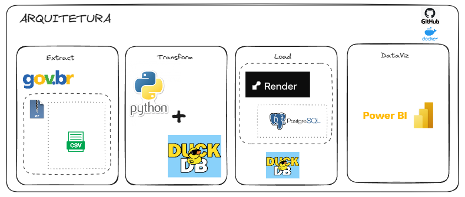

# Projeto de Scraping de Dados Abertos de CNPJ (em desenvolvimento)

## Este projeto é uma ferramenta para coletar dados abertos de CNPJ da Receita Federal.

Os dados desse projeto podem ser obtidos no [link:](https://dados.gov.br/dados/conjuntos-dados/cadastro-nacional-da-pessoa-juridica---cnpj)

A arquitetura do projeto pode ser acessada no [link:](https://excalidraw.com/#json=MHHcZhRNWNPJi_AJ7Nzl6,NlofrnWvpIcNr0P8WmIEeA)

Para instalar as dependências, recomenda-se o uso do Poetry. Certifique-se de ter o Poetry instalado em seu ambiente. Você pode instalar o Poetry seguindo as instruções em: [https://python-poetry.org/docs/#installation](https://python-poetry.org/docs/#installation)

1. Clone o repositório
2. Utilize a versão do Python 3.12.1

